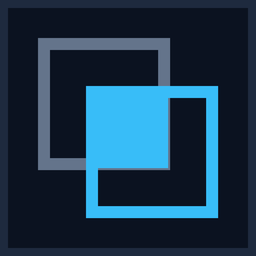

<div align="center">



# Argus Custode

**Detecție de schimbări în ortofotoplanuri de dronă.**

Zbori aceeași zonă de două ori, iar aplicația îți arată ce s-a schimbat între cele două
zboruri — marcat pe hartă și ordonat după cât de sigură e fiecare candidatură.

[](https://github.com/AGHEORONO/argus/actions/workflows/ci.yml)
[](https://argus-bay-one.vercel.app)


**[Deschide aplicația](https://argus-bay-one.vercel.app)**

</div>


---

## Ce face

Un operator de dronă care survolează același șantier lunar are, după un an, douăsprezece
ortofotoplanuri și nicio cale rapidă de a spune ce s-a mutat între ele. Argus Custode compară
două ridicări ale aceluiași sit și scoate în față zonele care s-au schimbat.

- **Ingestie cu verdict.** Setul de fotografii e verificat înainte de procesare — claritate,
  date GPS, suprapunere între cadre consecutive. Dacă nu trece, îți spune exact de ce.
- **Detecție fără antrenare prealabilă.** Trăsături calculate pe petice de 32×32 px, apoi
  Isolation Forest peste diferența dintre cele două ridicări. Nu are nevoie de exemple
  etichetate, ceea ce contează când fiecare sit arată altfel.
- **Rezultat verificabil.** Fiecare anomalie primește un scor, un rang, o suprafață și
  coordonate. Lista se exportă ca GeoJSON.
- **Hartă cu cursor de tranziție.** Cele două ortofotoplanuri stau suprapuse; cursorul le
  amestecă, deci vezi schimbarea, nu doar dreptunghiul care o marchează.
- **Trei moduri de rulare, aceeași bază de cod.** Server local, aplicație Windows de sine
  stătătoare, sau găzduire publică.

## Cum arată

<table>
<tr>
<td width="50%"></td>
<td width="50%"></td>
</tr>
<tr>
<td align="center"><em>înainte</em></td>
<td align="center"><em>după — containerul albastru apare exact în poligonul marcat</em></td>
</tr>
</table>

<table>
<tr>
<td width="50%"></td>
<td width="50%"></td>
</tr>
<tr>
<td align="center"><em>ingestie — set acceptat</em></td>
<td align="center"><em>ingestie — set respins, cu motivele enumerate</em></td>
</tr>
</table>


*Lista completă: fiecare candidat cu rang, scor, suprafață și coordonate, plus legătura către
schimbarea cunoscută pe care o acoperă.*

<details>
<summary><strong>Mai multe capturi</strong> — aplicația de desktop, navigarea de la tastatură, cursorul la jumătate</summary>

<br>


*Aceeași aplicație, ca fereastră Windows de sine stătătoare: interfața e servită din același
proces cu backendul, deci nu există CORS și nu e nevoie de browser.*


*Navigare completă de la tastatură, cu inel de focus vizibil pe fiecare țintă.*


*Cursorul de tranziție la 50%: cele două ridicări amestecate în aceeași fereastră.*

</details>

## Cum funcționează


| Componentă | Ce e |
|---|---|
| **Interfață** | React 19 · Vite 6 · MapLibre GL 5 — trei file (Ingestie, Comparație, Anomalii), hartă cu straturi înainte/după și cursor de tranziție |
| **Serviciu web** | FastAPI · Uvicorn — 21 de rute: zboruri, fotografii, validare, procesare, situri, comparații; server de dale XYZ generate la cerere din COG |
| **Stocare** | GeoTIFF/COG pentru rastere, SQLite (WAL) pentru zboruri, situri, capturi și comparații |

Un **sit** grupează **capturi** datate; o **comparație** e o rulare de detecție între oricare
două capturi ale aceluiași sit. Rădăcina datelor se mută cu `ARGUS_DATA_DIR`.

## Rezultate măsurate

Perechea sintetică de referință conține patru schimbări injectate, cu poligoane de adevăr
cunoscute. Benchmark-ul rulează în CI la fiecare push și **nu are voie să fie sărit** — dacă ar
fi, calitatea detecției n-ar mai fi măsurată de nimeni.


| Măsură | Valoare |
|---|---|
| Schimbări regăsite | **4 din 4** |
| Adâncime maximă de regăsire | **rangul 10** (seed `20260826`, top 50) |
| Precizie pe candidații care ating o schimbare reală | **18 din 18** |
| Teste | **91** colectate cu pytest (86 trec, 1 sărit, 4 rulează numai pe Windows) plus **48** Playwright |


Rangul depinde de rulare: cifrele de mai sus vin din testul de referință cu seed-ul
`20260826`. Zborul demonstrativ salvat în aplicație a fost calculat cu altă rulare și afișează
pe ecran o adâncime diferită — ambele sunt adevărate.

## Rulare locală

Windows, într-o singură comandă:

```powershell
.\start-local.ps1
```

Pornește backendul pe `127.0.0.1:8077` și interfața pe `127.0.0.1:4173`. Prima pornire poate
dura un minut: dacă lipsesc datele demo, backendul le descarcă și calculează detecția înainte
de a răspunde.

Manual:

```bash
python -m venv .venv && .venv/bin/pip install -r app/requirements.txt
python -m uvicorn app.backend.main:app --port 8000 --reload

cd app/frontend && npm install && npm run dev
```

Interfața citește adresa backendului din `VITE_API_BASE` (vezi `app/frontend/.env.example`).

Teste:

```bash
python -m pytest tests/ -v -rs
cd app/frontend && npm run test:e2e
```

## Aplicație Windows de sine stătătoare

```powershell
.\build-desktop.ps1
```

Produce `dist-desktop\Argus Custode\` (folder cu `.exe`) și `Argus-Custode-windows.zip`
(~300 MB). Backendul pornește pe un port local ales la rulare și servește și interfața din
aceeași origine; fereastra e WebView2 (Edge), preinstalat pe Windows 11.

Datele stau în `%LOCALAPPDATA%\Argus`, împreună cu `argus-desktop.log` — primul lucru de citit
dacă aplicația nu pornește. Executabilul e nesemnat: prima rulare arată un avertisment
SmartScreen (*Mai multe informații → Executați oricum*).

## Accesibilitate

Navigare completă de la tastatură, cu inel de focus vizibil pe fiecare țintă interactivă.
Reflow verificat la 320 px. Suita Playwright include o verificare axe-core care rulează în CI,
deci o regresie de accesibilitate sparge build-ul în loc să ajungă în producție.

## Structura repo-ului

| Cale | Ce e |
|---|---|
| `app/backend/` | FastAPI: ingestie, detecție, dale, situri și comparații |
| `app/frontend/` | React, Vite, MapLibre |
| `desktop/`, `build-desktop.ps1` | împachetare PyInstaller + WebView2 pentru Windows |
| `tests/` | pytest, inclusiv benchmark-ul de recall și auditul de regresie |
| `Practica/` | dosarul de practică: caiet, atestat, capturi |
| `CodeVault/` | vault Obsidian: plan, decizii, jurnal, întrebări deschise |
| `data/` | imagini și rastere — ignorat de git, nu ajunge niciodată în repo |

## Dosarul de practică

Proiectul a fost realizat ca lucrare de practică. Documentele sunt în [`Practica/`](Practica/):

- [Caietul de practică, cu anexa de instantanee la final](Practica/Caiet%20de%20practica%20-%20RECUPERAT%20cu%20anexa.pdf)
- [Atestatul de practică](Practica/Atestat%20de%20practica%20-%20completat.pdf)
- [`capturi/`](Practica/capturi/) — cele 15 capturi, cu legendele și locul lor în text

Notele de lucru (plan, decizii, jurnal) sunt în vault-ul Obsidian din `CodeVault/`, scrise în
română. Deschide folderul ca vault și pornește de la
`CodeVault/projects/argus/Argus Custode.md`.


<details>
<summary><strong>Continuare pe alt calculator</strong> — clonare, skill-uri de agent, Obsidian Git</summary>

<br>

```bash
git clone https://github.com/AGHEORONO/argus.git
cd argus
```

Instalarea skill-urilor de agent: `.\setup-skills.ps1` pe Windows, sau
`chmod +x setup-skills.sh && ./setup-skills.sh` pe macOS/Linux.

Pentru sincronizarea automată a notelor: Obsidian → Settings → Community plugins → Browse →
„Obsidian Git" → Install → Enable. Setările implicite sunt bune — face commit pe un
temporizator și trage la deschiderea vault-ului. Se instalează pe fiecare calculator.
Modificările de cod rămân prin CLI.

</details>

## Deploy

Interfața pe Vercel (`vercel.json`), serviciul web pe Render prin Docker (`render.yaml`,
`Dockerfile`). Aceeași bază de cod ca rularea locală și ca aplicația de desktop — diferă doar
modul de build.
